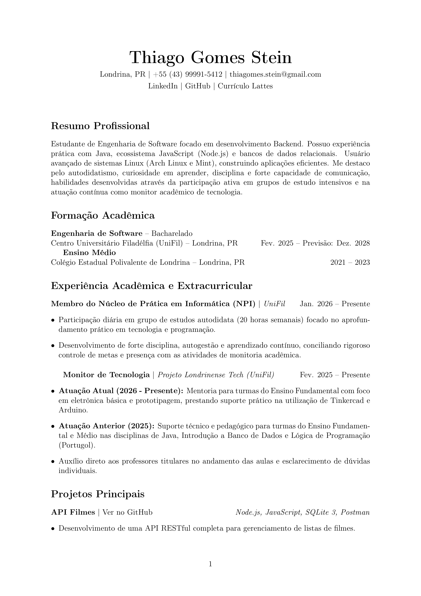
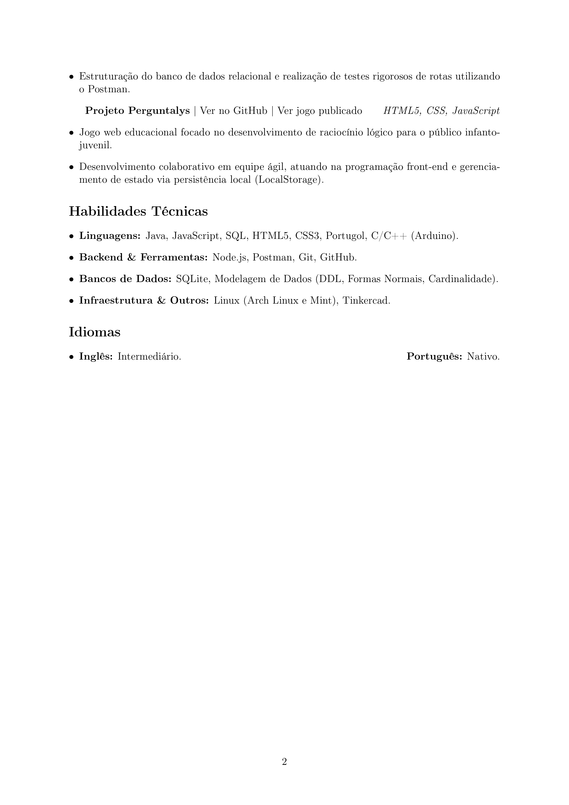

# Curriculo

## Por que em LaTeX?
Eu escolhi fazer o meu currículo em LaTeX pelos seguintes motivos:
* **Consistência visual:** A formatação nunca "quebra", independente de onde o PDF for aberto.
* **Leitura otimizada por robôs (ATS):** O PDF gerado pelo LaTeX tem o texto perfeitamente extraível, evitando que eu seja descartado em triagens automáticas de vagas.
* **Versionamento (Resume as Code):** Trato minha evolução profissional como código, mantendo um histórico claro de todas as atualizações e melhorias no meu perfil.

Vale dizer que utilizei o site Overleaf para a criação do currículo que vem a seguir!

---

  
    
  

---
## Links Oficiais
* [LinkedIn](https://www.linkedin.com/in/thiago-gomes-stein-31649a35b/)
* [GitHub Pessoal](https://github.com/Thiago-Stein)
* [Currículo Lattes](http://lattes.cnpq.br/0305313799581622)
